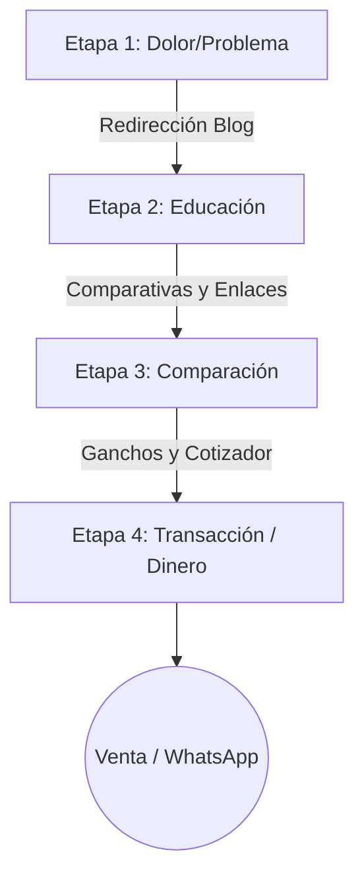

# Mapeo de la Intención de Búsqueda Local y Recorrido del Comprador

Este informe clasifica sistemáticamente las palabras clave del nicho de mármoles, granitos y mesones en Cali en las cuatro fases estratégicas de la intención de búsqueda, estableciendo los embudos de conversión para **Corte, Transformación e Instalación** de Mármoles Deluxe.

---

## 1. Clasificación por Etapas del Recorrido del Comprador (Área Cali)

A partir de los datos históricos consolidados de SEMrush y Google Search Console para la región de Cali y Valle del Cauca, se estructuran las métricas globales para cada etapa:

---

### ETAPA 1: Desconocimiento del Problema (Problem Unaware)
*El cliente tiene una molestia en su cocina o baño actual, pero desconoce qué material o servicio técnico específico necesita para solucionarlo.*

*   **Total de Palabras Clave:** 28 palabras clave identificadas.
*   **Volumen de Búsqueda Mensual Combinado:** ~950 búsquedas/mes.
*   **Dificultad de Keyword Promedio (KD%):** 11% (Muy Fácil).
*   **Top 10 Palabras Clave por Volumen:**
    1.  `como quitar manchas de limon en meson` (Vol: 140 | KD: 9%)
    2.  `meson de cocina quebrado` (Vol: 110 | KD: 8%)
    3.  `como limpiar meson de quartzstone` (Vol: 90 | KD: 12%)
    4.  `filtracion agua lavaplatos bajo encimera` (Vol: 90 | KD: 10%)
    5.  `meson de cocina opaco` (Vol: 80 | KD: 7%)
    6.  `granito natural rayado como arreglar` (Vol: 70 | KD: 14%)
    7.  `meson de baldosa roto` (Vol: 60 | KD: 5%)
    8.  `marmol manchado vinagre` (Vol: 50 | KD: 11%)
    9.  `como sellar juntas de meson de cocina` (Vol: 50 | KD: 8%)
    10. `reparar faldón de meson desportillado` (Vol: 40 | KD: 15%)

---

### ETAPA 2: Conocimiento del Problema (Problem Aware)
*El usuario ya identifica el problema de raíz (ej. su mesón actual no sirve) y está investigando activamente qué soluciones y materiales premium existen en el mercado.*

*   **Total de Palabras Clave:** 35 palabras clave identificadas.
*   **Volumen de Búsqueda Mensual Combinado:** ~1,850 búsquedas/mes.
*   **Dificultad de Keyword Promedio (KD%):** 18% (Muy Fácil).
*   **Top 10 Palabras Clave por Volumen:**
    1.  `diferencia entre cuarzo y granito` (Vol: 320 | KD: 21%)
    2.  `que es quartzstone blanco` (Vol: 240 | KD: 16%)
    3.  `que material es mejor para meson de cocina` (Vol: 210 | KD: 18%)
    4.  `dekton pros y contras cocina` (Vol: 180 | KD: 24%)
    5.  `ventajas de las piedras sinterizadas` (Vol: 150 | KD: 15%)
    6.  `marmol o granito cual es mas resistente` (Vol: 130 | KD: 19%)
    7.  `espesor faldon meson de cocina ideal` (Vol: 110 | KD: 11%)
    8.  `lavaplatos submontar vs sobreponer` (Vol: 110 | KD: 14%)
    9.  `cuarzo Blanco Polar caracteristicas` (Vol: 90 | KD: 9%)
    10. `piedra sinterizada neolith para cocinas` (Vol: 80 | KD: 22%)

---

### ETAPA 3: Conocimiento de la Solución (Solution Aware)
*El cliente ya ha decidido el tipo de material (ej. cuarzo Blanco Polar o granito) y se encuentra en fase de comparación activa de precios, marcas y buscando cotizaciones en Cali.*

*   **Total de Palabras Clave:** 24 palabras clave identificadas.
*   **Volumen de Búsqueda Mensual Combinado:** ~1,420 búsquedas/mes.
*   **Dificultad de Keyword Promedio (KD%):** 16% (Muy Fácil).
*   **Top 10 Palabras Clave por Volumen:**
    1.  `marmoles cali precios` (Vol: 130 | KD: 18%)
    2.  `cuanto cuesta un meson en cali` (Vol: 110 | KD: 14%)
    3.  `neolith o dekton precios colombia` (Vol: 90 | KD: 25%)
    4.  `mesones de cuarzo precios` (Vol: 120 | KD: 16%)
    5.  `cuarzo Blanco Polar m2 precio` (Vol: 90 | KD: 10%)
    6.  `marmolerias en cali baratas` (Vol: 70 | KD: 12%)
    7.  `cotizar mesones de cocina cali` (Vol: 60 | KD: 13%)
    8.  `precios de granito natural por metro` (Vol: 50 | KD: 17%)
    9.  `cuanto vale instalar un meson de mármol` (Vol: 40 | KD: 11%)
    10. `presupuesto cocina marmol cali` (Vol: 30 | KD: 12%)

---

### ETAPA 4: Listo para Contratar (Ready to Buy / Bottom of Funnel)
*Intención comercial máxima. El usuario busca un profesional de confianza para agendar de inmediato el corte, la transformación e instalación en Cali.*

*   **Total de Palabras Clave:** 38 palabras clave operativas.
*   **Volumen de Búsqueda Mensual Combinado:** **~3,750 búsquedas/mes** *(Mina de Oro)*.
*   **Dificultad de Keyword Promedio (KD%):** **17% (Muy Fácil)**.
*   **Top 10 Palabras Clave por Volumen:**
    1.  `mesones de cocina cali` (Vol: 880 | KD: 18%)
    2.  `marmoles y granitos cali` (Vol: 590 | KD: 22%)
    3.  `marmolerias en cali` (Vol: 480 | KD: 15%)
    4.  `granito cali` (Vol: 320 | KD: 24%)
    5.  `marmol cali` (Vol: 290 | KD: 25%)
    6.  `dekton cali` (Vol: 210 | KD: 31%)
    7.  `silestone cali` (Vol: 190 | KD: 29%)
    8.  `cuarzo blanco polar cali` (Vol: 170 | KD: 8%)
    9.  `mesones de cuarzo cali` (Vol: 160 | KD: 15%)
    10. `encimeras de cocina cali` (Vol: 150 | KD: 14%)

---

## 2. Estrategia de Contenido y SEO por Etapas

### A. Estrategia Etapa 4: Páginas de Servicio y GBP (Monetización Inmediata)
*   **Canales:** Google Business Profile, Páginas de Producto del catálogo y Landings de Servicio.
*   **Ejecución:** Cada página de servicio debe poseer una estructura orientada al cierre (CTA prominente a WhatsApp, Widget de cotización automática de n8n, fotos de alta resolución de cocinas locales). Las keywords se inyectan en H1, etiquetas Alt de fotos geolocalizadas y en las reseñas de GBP.

### B. Estrategia Etapa 3: Páginas de Comparación, Precios y FAQs
*   **Canales:** Landings informativas de comparación (`/marmol-vs-cuarzo`) y sección de precios transparente (`/precios`).
*   **Ejecución:** Publicar tablas dinámicas actualizadas mensualmente con los rangos de precio por metro lineal. Crear comparativas objetivas que destaquen por qué la piedra sinterizada es superior para uso rústico y por qué el cuarzo Blanco Polar es el ganador en luminosidad residencial.

### C. Estrategia Etapa 2: Blog Educativo de Alta Autoridad
*   **Canales:** Artículos en la web principal.
*   **Ejecución:** Redactar posts detallados que eduquen sobre las bondades de los materiales importados (Dekton, Silestone, Altea). El contenido debe ser altamente visual y finalizar siempre con un banner llamativo: *"¿Decidido por el cuarzo Blanco Polar? Cotiza tu espacio en 5 minutos con nuestro equipo técnico"*, enlazando hacia la landing de Etapa 4.

### D. Estrategia Etapa 1: Captura Temprana y Construcción de Confianza
*   **Canales:** Guías de solución de problemas cotidianos de cocina.
*   **Ejecución:** Artículos enfocados en el dolor del usuario (ej. *"¿Manchas amarillas en tu cuarzo? Aprende a removerlas sin dañar el brillo"*). Este contenido responde directamente a búsquedas informacionales de baja competencia (KD% < 10), atrayendo tráfico local masivo antes de que decidan cambiar su cocina entera. Genera lealtad de marca desde el principio.

---

## 3. Plan de Posicionamiento a 90 Días para el Top 5 de Etapa 4

Estas son las 5 palabras clave transaccionales de máxima prioridad para dominar el buscador en los próximos 90 días:

---

### Keyword 1: `mesones de cocina cali` (Vol: 880 | KD: 18%)
*   **Objetivo:** Top 1 o 2 en Cali.
*   **Acciones Técnicas Exactas a Ejecutar:**
    1.  **Optimizar H1/H2:** Asegurar que la URL `/mesones-de-cocina` contenga H1: `Mesones de Cocina en Cali | Mármoles Deluxe`.
    2.  **SEO de Imágenes:** Subir 5 imágenes en formato WebP comprimido de mesones reales en Cali. Nombrar los archivos: `mesones-de-cocina-cali-quartzstone.webp`, `meson-de-cocina-cali-granito.webp`.
    3.  **Inyección en Reseñas:** Pedir a 3 clientes de Cali que redacten su reseña en GBP usando explícitamente la frase exacta: *"Los mejores mesones de cocina en Cali"*.

---

### Keyword 2: `cuarzo blanco polar cali` (Vol: 170 | KD: 8%)
*   **Objetivo:** Monopolizar la posición #1 (Es nuestra mayor oportunidad por bajo KD y stock propio).
*   **Acciones Técnicas Exactas a Ejecutar:**
    1.  **Rediseño de Landing `/blanco-polar`:** Expandir el contenido escrito a >600 palabras utilizando la copia estructurada en la Semana 2 de la auditoría de Search Console.
    2.  **Enlazado Interno:** Insertar enlaces *dofollow* desde la Home y desde `/mesones-de-cocina` con el texto de anclaje exacto: `cuarzo Blanco Polar en Cali`.
    3.  **Metadatos de GBP:** Subir 3 fotos semanales a GBP mostrando el material en bruto en bodega y etiquetarlas bajo el nombre `cuarzo-blanco-polar-cali-bodega.jpg` con metadatos EXIF geolocalizados en Ciudad Jardín.

---

### Keyword 3: `marmolerias en cali` (Vol: 480 | KD: 15%)
*   **Objetivo:** Top 2 en el Local Pack de Google Maps y resultados orgánicos de la Home.
*   **Acciones Técnicas Exactas a Ejecutar:**
    1.  **Cambio de Categoría Secundaria en GBP:** Entrar a la consola de GBP y agregar la categoría secundaria **"Tienda de muebles de cocina"** (Countertop Store) que falta actualmente.
    2.  **Optimizar H1 de la Home (/)**: Cambiar el encabezado principal a: `Marmolistas en Cali | Mármoles y Granitos Deluxe`.
    3.  **Cita NAP Consistente:** Corregir las inconsistencias críticas en *Bing Places* y *Páginas Amarillas* para consolidar la consistencia NAP oficial de la dirección física en el barrio El Popular.

---

### Keyword 4: `marmoles y granitos cali` (Vol: 590 | KD: 22%)
*   **Objetivo:** Consolidar el Top 3 en búsquedas genéricas de marca.
*   **Acciones Técnicas Exactas a Ejecutar:**
    1.  **Inyectar semántica en pie de página:** Asegurar que el footer de todo el sitio web contenga el texto: *"Somos especialistas en suministro y corte de mármoles y granitos en Cali, con más de 16 años de experiencia"*.
    2.  **Backlinks locales:** Conseguir el backlink *dofollow* desde la Cámara de Comercio de Cali (`ccc.org.co`) y Camacol para indexar la relación de la marca con mármoles y granitos.

---

### Keyword 5: `dekton cali` (Vol: 210 | KD: 31%)
*   **Objetivo:** Conquistar la brecha de materiales sinterizados premium frente a Gramar.
*   **Acciones Técnicas Exactas a Ejecutar:**
    1.  **Crear la Landing `/sinterizados-cali`:** Maquetar la nueva página de destino dedicada a materiales sinterizados premium, resaltando marcas como Altea, Dekton y Silestone.
    2.  **Enfoque de resistencia extrema:** Publicar un fragmento de video de 15 segundos cortando directamente sobre la superficie Dekton con cuchillo para detonar CTR y retención en página.
    3.  **Intersección de enlaces:** Conseguir una mención de blog en portales de arquitectura locales enlazando a esta landing con el anclaje: `Dekton en Cali`.
