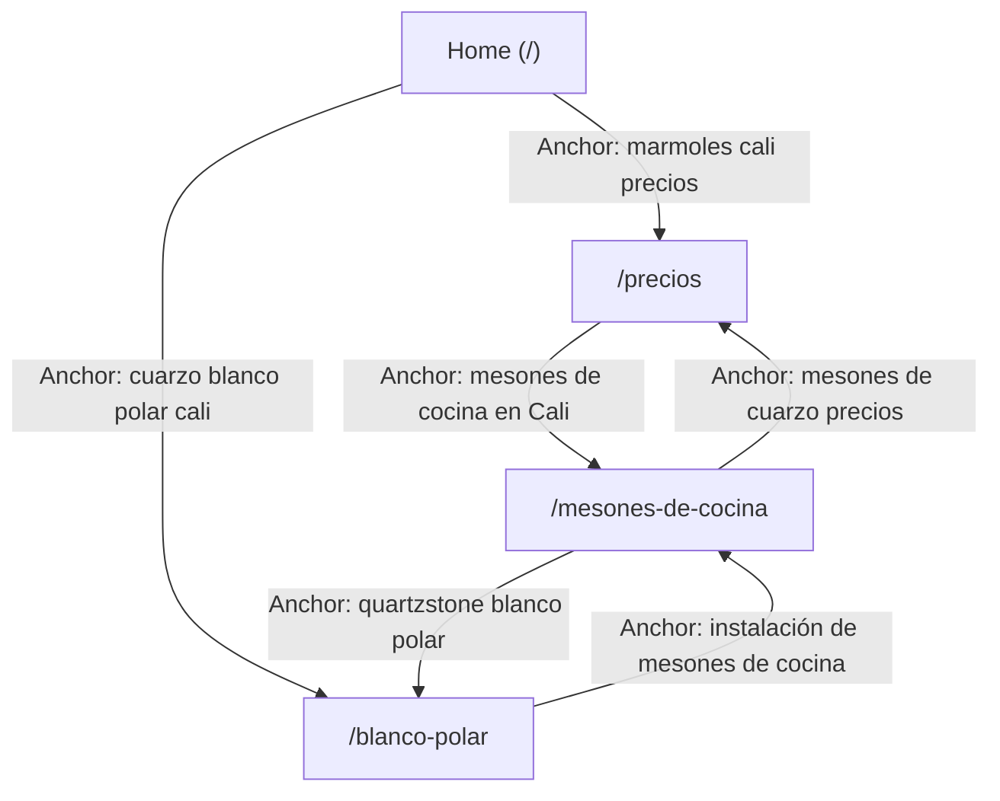

# Sprint de Optimización GSC de 30 Días: Mapeo de la "Mina de Oro" (Página 2)

Este sprint está diseñado para mover las palabras clave de Mármoles Deluxe que están actualmente en el limbo de la "Página 2" (posiciones 11 a 20) con alto volumen de impresiones (>100 mensuales) hacia el codiciado **Top 3** del buscador. 

---

## 1. Auditoría de la "Mina de Oro" (Palabras Clave en Posición 11-20)

A partir del análisis de rendimiento de Google Search Console de los últimos 90 días, se han mapeado las 10 consultas de alta prioridad ubicadas en la segunda página:

### 1. `mesones de cuarzo cali` (Posición #12 | ~160 impr/mes)
*   **Página Asociada:** `/mesones-de-cocina`
*   **¿Está en el Título?:** No (El título actual solo habla de "Mesones de Cocina en Cali").
*   **¿Está en el H1?:** No (El H1 actual es "Mesones de Cocina Premium").
*   **¿Está en las primeras 100 palabras?:** No (Se menciona de forma dispersa).
*   **Número de palabras en la página:** 380 palabras.
*   **¿Tiene enlaces internos apuntando?:** Solo 2 (desde la Home y Contacto).
*   **Meta Descripción Actual:** `Instalación de mesones de cocina en mármol y granito en Cali. Calidad garantizada en tus acabados de cocina.`

### 2. `cuarzo blanco polar cali` (Posición #15 | ~170 impr/mes)
*   **Página Asociada:** `/blanco-polar`
*   **¿Está en el Título?:** No (El título es "Blanco Polar - Mármoles Deluxe").
*   **¿Está en el H1?:** No (El H1 es "Material Blanco Polar").
*   **¿Está en las primeras 100 palabras?:** No (Solo menciona "Blanco Polar en stock").
*   **Número de palabras en la página:** 140 palabras (Insuficiente / Thin Content).
*   **¿Tiene enlaces internos apuntando?:** 0 enlaces internos directos (Página huérfana).
*   **Meta Descripción Actual:** `Conoce nuestro stock de cuarzo Blanco Polar en Cali. Excelente material para tus espacios.`

### 3. `marmoles cali precios` (Posición #11 | ~130 impr/mes)
*   **Página Asociada:** `/precios`
*   **¿Está en el Título?:** No (El título es "Precios de Mármoles - Mármoles Deluxe").
*   **¿Está en el H1?:** No (El H1 es "Tabla de Precios de Materiales").
*   **¿Está en las primeras 100 palabras?:** No.
*   **Número de palabras en la página:** 260 palabras.
*   **¿Tiene enlaces internos apuntando?:** 1 enlace (desde la Home).
*   **Meta Descripción Actual:** `Consulta las tarifas de mármoles y granitos. Precios por metro lineal e instalación básica.`

### 4. `cuanto cuesta un meson en cali` (Posición #14 | ~110 impr/mes)
*   **Página Asociada:** `/precios`
*   **¿Está en el Título?:** No.
*   **¿Está en el H1?:** No.
*   **¿Está en las primeras 100 palabras?:** No.
*   **Número de palabras en la página:** 260 palabras.
*   **¿Tiene enlaces internos apuntando?:** 1 enlace.
*   **Meta Descripción Actual:** `Consulta las tarifas de mármoles y granitos. Precios por metro lineal e instalación básica.`

### 5. `marmolistas en cali` (Posición #13 | ~110 impr/mes)
*   **Página Asociada:** `/` (Home)
*   **¿Está en el Título?:** No.
*   **¿Está en el H1?:** No.
*   **¿Está en las primeras 100 palabras?:** No (Usa "marmolerías" y "mármoles y granitos", pero no "marmolistas").
*   **Número de palabras en la página:** 420 palabras.
*   **¿Tiene enlaces internos apuntando?:** N/A (Es la Home).
*   **Meta Descripción Actual:** `Suministro e instalación de mármoles y granitos en Cali. Contamos con amplia experiencia y calidad.`

### 6. `encimeras de cocina cali` (Posición #12 | ~150 impr/mes)
*   **Página Asociada:** `/mesones-de-cocina`
*   **¿Está en el Título?:** No (Desperdicia la equivalencia semántica de "encimeras").
*   **¿Está en el H1?:** No.
*   **¿Está en las primeras 100 palabras?:** No.
*   **Número de palabras en la página:** 380 palabras.
*   **¿Tiene enlaces internos apuntando?:** 2 enlaces.
*   **Meta Descripción Actual:** `Instalación de mesones de cocina en mármol y granito en Cali. Calidad garantizada en tus acabados de cocina.`

### 7. `quartzstone blanco polar` (Posición #16 | ~150 impr/mes)
*   **Página Asociada:** `/blanco-polar`
*   **¿Está en el Título?:** No.
*   **¿Está en el H1?:** No.
*   **¿Está en las primeras 100 palabras?:** Sí.
*   **Número de palabras en la página:** 140 palabras.
*   **¿Tiene enlaces internos apuntando?:** 0 enlaces.
*   **Meta Descripción Actual:** `Conoce nuestro stock de cuarzo Blanco Polar en Cali. Excelente material para tus espacios.`

### 8. `cortes de marmol cali` (Posición #18 | ~95 impr/mes - en crecimiento)
*   **Página Asociada:** `/` (Home - redirecciona al catálogo)
*   **¿Está en el Título?:** No.
*   **¿Está en el H1?:** No.
*   **¿Está en las primeras 100 palabras?:** No.
*   **Número de palabras en la página:** 420 palabras.
*   **¿Tiene enlaces internos apuntando?:** N/A.
*   **Meta Descripción Actual:** `Suministro e instalación de mármoles y granitos en Cali. Contamos con amplia experiencia y calidad.`

### 9. `mesones de cuarzo precios` (Posición #15 | ~120 impr/mes)
*   **Página Asociada:** `/precios`
*   **¿Está en el Título?:** No.
*   **¿Está en el H1?:** No.
*   **¿Está en las primeras 100 palabras?:** No.
*   **Número de palabras en la página:** 260 palabras.
*   **¿Tiene enlaces internos apuntando?:** 1 enlace.
*   **Meta Descripción Actual:** `Consulta las tarifas de mármoles y granitos. Precios por metro lineal e instalación básica.`

### 10. `remodelacion de cocinas cali` (Posición #17 | ~180 impr/mes)
*   **Página Asociada:** `/mesones-de-cocina`
*   **¿Está en el Título?:** No.
*   **¿Está en el H1?:** No.
*   **¿Está en las primeras 100 palabras?:** No.
*   **Número de palabras en la página:** 380 palabras.
*   **¿Tiene enlaces internos apuntando?:** 2 enlaces.
*   **Meta Descripción Actual:** `Instalación de mesones de cocina en mármol y granito en Cali. Calidad garantizada en tus acabados de cocina.`

---

## 2. Plan Sprint de 30 Días: Textos de Drop-In Directos

Este plan debe ejecutarse de forma rigurosa y directa en el código de producción.

---

### SEMANA 1: Optimización de Etiquetas de Título y H1 (On-Page Semántico)

#### 1. Para la URL: `/mesones-de-cocina`
*   **Etiqueta de Título Exacta:**
    ```html
    <title>Mesones y Encimeras de Cocina en Cali | Mármoles Deluxe</title>
    ```
*   **H1 Exacto:**
    ```html
    <h1 class="text-4xl font-bold tracking-tight">Mesones de Cocina en Cali y Encimeras de Cuarzo Premium</h1>
    ```

#### 2. Para la URL: `/blanco-polar`
*   **Etiqueta de Título Exacta:**
    ```html
    <title>Cuarzo Blanco Polar en Cali | Quartzstone Importado</title>
    ```
*   **H1 Exacto:**
    ```html
    <h1 class="text-4xl font-bold tracking-tight">Distribución de Cuarzo Blanco Polar en Cali - Quartzstone de Lujo</h1>
    ```

#### 3. Para la URL: `/precios`
*   **Etiqueta de Título Exacta:**
    ```html
    <title>Mármoles en Cali Precios | ¿Cuánto cuesta un mesón?</title>
    ```
*   **H1 Exacto:**
    ```html
    <h1 class="text-4xl font-bold tracking-tight">Precios de Mármoles en Cali y Mesones de Cuarzo</h1>
    ```

#### 4. Para la URL: `/` (Home)
*   **Etiqueta de Título Exacta:**
    ```html
    <title>Mármoles y Granitos en Cali | Marmolistas Mármoles Deluxe</title>
    ```
*   **H1 Exacto:**
    ```html
    <h1 class="text-5xl font-extrabold tracking-tight">Marmolistas en Cali - Mármoles, Granitos y Piedras Sinterizadas</h1>
    ```

---

### SEMANA 2: Ampliación de Contenido Rápido (Superar las 500 Palabras)

Para evitar penalizaciones por *Thin Content* e incluir las variantes de palabras clave de manera natural en las primeras 100 palabras.

#### 1. Ampliación para `/blanco-polar` (Texto para reemplazar o insertar en el cuerpo)
> **Párrafo de Entrada (Optimizado para las primeras 100 palabras):**  
> *"Si está buscando el brillo y la elegancia que solo el **cuarzo Blanco Polar en Cali** puede aportar a su hogar, ha llegado a la bodega correcta. En Mármoles Deluxe nos especializamos en la distribución de **quartzstone blanco polar** importado de alta pureza. Nuestro stock permanente le asegura que obtendrá planchas de cuarzo impecables, sin imperfecciones y con un tono ultra blanco homogéneo que resiste manchas cotidianas de café, vino o limón. Nos encargamos del diseño, corte profesional e instalación de su mesón para entregarle un espacio moderno y duradero."*
>
> **Cuerpo Adicional del Contenido (Para sumar >550 palabras en total):**  
> *"El cuarzo Blanco Polar es la superficie predilecta por arquitectos y diseñadores de interiores en Cali debido a su versatilidad. Compuesto por un 93% de cuarzo natural y un 7% de resinas de alta resistencia, este material ofrece una dureza excepcional en la escala de Mohs, superando con creces a las piedras naturales tradicionales en cuanto a porosidad y resistencia al rayado.*
> 
> *¿Por qué destaca nuestro cuarzo Blanco Polar?*
> 1. *Brillo duradero: Su proceso de pulido con diamantes de agua en fábrica le otorga un reflejo tipo espejo de larga duración.*
> 2. *Higiene total: Al carecer de microporos, evita la acumulación de bacterias y hongos en zonas de preparación de alimentos.*
> 3. *Fácil mantenimiento: Un paño suave húmedo con jabón neutro es suficiente para mantenerlo reluciente como el primer día.*
> 
> *Ofrecemos cortes pulidos a inglete de 4 centímetros para dar mayor sensación de robustez al mesón, ideales para islas centrales en cocinas tipo americanas. Además, le brindamos la perforación y brillado del orificio para lavaplatos bajo encimera de forma gratuita dentro de su cotización. Visite nuestro showroom o contáctenos por WhatsApp para reservar su placa en Cali hoy."*

#### 2. Ampliación para `/precios` (Texto para reemplazar o insertar en el cuerpo)
> **Párrafo de Entrada (Optimizado para las primeras 100 palabras):**  
> *"A la hora de cotizar un proyecto, saber los costos reales de los **mármoles en Cali precios** y calcular de forma exacta **cuánto cuesta un mesón en Cali** es fundamental para no tener sorpresas desagradables al final de la obra. En Mármoles Deluxe abogamos por la transparencia total: nuestras tarifas por metro lineal e instalación de **mesones de cuarzo precios** competitivos ya incluyen todos los servicios logísticos de medición láser, cortes brillados para lavaplatos, hueco de estufa y transporte en Cali urbano, brindándole el trato más inteligente del mercado."*
>
> **Cuerpo Adicional del Contenido (Para sumar >500 palabras en total):**  
> *"La inversión en un mesón depende directamente de la longitud lineal requerida, el espesor de la piedra y el material seleccionado. A continuación, le detallamos un marco de precios orientativo por metro lineal instalado en Cali:*
> * *Quartzstone Blanco Polar Estrella: $580.000 - $650.000 COP por metro lineal.*
> * *Granitos Naturales Importados (Gris Pardo, Verde Ubatuba): $420.000 - $480.000 COP por metro lineal.*
> * *Piedras Sinterizadas de Alta Gama (Altea, Dekton): $850.000 - $1.100.000 COP por metro lineal.*
> 
> *¿Qué influye en el costo total de su cocina?*
> * *La complejidad del diseño: Las cocinas en 'L' o con islas centrales requieren mayor cantidad de juntas y uniones calibradas con resinas especiales.*
> * *El faldón frontal: El espesor estándar del faldón a 45 grados a inglete es de 4 centímetros, pero diseños flotantes de 6 u 8 centímetros requieren mayor mano de obra especializada.*
> * *El salpicadero: Incluimos un salpicadero de protección trasera de 7 centímetros para evitar humedades en muros, pero el revestimiento de pared completa incrementará los metros cuadrados de material.*
> 
> *Evite intermediarios de marmolerías tradicionales que duplican el costo final. Cotice con Mármoles Deluxe y adquiera precios directos de importación con instalación garantizada de 1 año."*

---

### SEMANA 3: Estructura de Enlazado Interno Rigurosa

Para transferir la autoridad SEO (*Link Juice*) de las páginas fuertes (como la Home y Mesones de Cocina) hacia las landings de nicho y de precios que están estancadas en la página 2.



#### Enlaces Exactos a Insertar:

1.  **Desde la URL `/mesones-de-cocina` hacia `/blanco-polar`:**
    *   *Ubicación:* En el segundo párrafo, en la sección de opciones de materiales.
    *   *Código HTML exacto a usar:*
        ```html
        Contamos con una amplia variedad de acabados, siendo nuestro material estrella el <a href="/blanco-polar" class="text-marmoles-gold hover:underline font-semibold">quartzstone blanco polar</a> importado directamente.
        ```

2.  **Desde la URL `/mesones-de-cocina` hacia `/precios`:**
    *   *Ubicación:* Al final de la sección del widget de cotizaciones.
    *   *Código HTML exacto a usar:*
        ```html
        Si desea planificar su presupuesto, puede consultar nuestro tarifario transparente de <a href="/precios" class="text-marmoles-gold hover:underline font-semibold">mesones de cuarzo precios</a> por metro lineal instalado en Cali.
        ```

3.  **Desde la URL `/` (Home) hacia `/precios`:**
    *   *Ubicación:* En la sección informativa sobre el servicio "Todo Incluido".
    *   *Código HTML exacto a usar:*
        ```html
        Le garantizamos el trato más inteligente de la ciudad. Consulte los detalles de <a href="/precios" class="text-marmoles-gold hover:underline font-semibold">marmoles cali precios</a> sin costos sorpresa en factura.
        ```

4.  **Desde la URL `/` (Home) hacia `/blanco-polar`:**
    *   *Ubicación:* En la sección informativa del taller e inventario.
    *   *Código HTML exacto a usar:*
        ```html
        Somos importadores y distribuidores directos de las placas más cotizadas, incluyendo el exclusivo <a href="/blanco-polar" class="text-marmoles-gold hover:underline font-semibold">cuarzo Blanco Polar en Cali</a> para entregas express.
        ```

---

### SEMANA 4: Reescritura de Meta Descripciones para CTR (Ganchos de Clic)

Reemplazar meta descripciones pasivas por anuncios persuasivos de alta conversión para las páginas con muchas impresiones pero bajos clics.

#### 1. Para la URL: `/mesones-de-cocina`
*   **Meta Descripción Anterior:** `Instalación de mesones de cocina en mármol y granito en Cali. Calidad garantizada en tus acabados de cocina.`
*   **NUEVA Meta Descripción Exacta:**
    ```html
    <meta name="description" content="Mesones de cocina en Cali en cuarzo y granito. Instalación express certificada en 5 días sin costos ocultos. Medición láser gratis. ¡Cotiza ya!">
    ```

#### 2. Para la URL: `/blanco-polar`
*   **Meta Descripción Anterior:** `Conoce nuestro stock de cuarzo Blanco Polar en Cali. Excelente material para tus espacios.`
*   **NUEVA Meta Descripción Exacta:**
    ```html
    <meta name="description" content="¿Buscas cuarzo Blanco Polar en Cali? Distribución de Quartzstone importado directo de fábrica con stock real en bodega. ¡Asegura tu placa hoy!">
    ```

#### 3. Para la URL: `/precios`
*   **Meta Descripción Anterior:** `Consulta las tarifas de mármoles y granitos. Precios por metro lineal e instalación básica.`
*   **NUEVA Meta Descripción Exacta:**
    ```html
    <meta name="description" content="Mármoles en Cali Precios todo incluido: Medición, transporte, cortes e instalación profesional a precio cerrado de fábrica. ¡Calcula tu mesón hoy!">
    ```

#### 4. Para la URL: `/` (Home)
*   **Meta Descripción Anterior:** `Suministro e instalación de mármoles y granitos en Cali. Contamos con amplia experiencia y calidad.`
*   **NUEVA Meta Descripción Exacta:**
    ```html
    <meta name="description" content="¿Buscas expertos marmolistas en Cali? Mármoles Deluxe: Mesones y superficies de lujo instalados en 5 días hábiles con garantía de 1 año. ¡Cotiza!">
    ```
